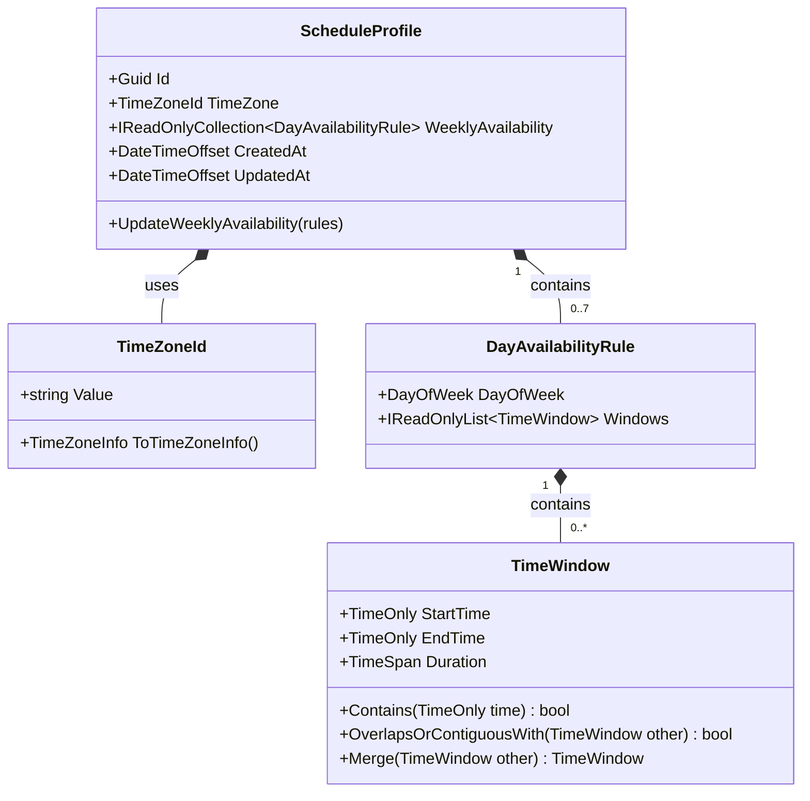

# Data Model: Onboarding Inicial & Perfil de Calendário

**Feature**: `001-initial-onboarding` | **Status**: Approved

## 1. Domain Entities & Value Objects



### ScheduleProfile (Aggregate Root)
- **Identificador**: `Guid Id` (gerado pelo backend com UUIDv7).
- **TimeZone**: `TimeZoneId` (Value Object validando fuso horário IANA).
- **WeeklyAvailability**: Coleção de `DayAvailabilityRule` para os dias da semana (0 = Sunday a 6 = Saturday ou 1 = Monday a 7 = Sunday).
- **CreatedAt / UpdatedAt**: `DateTimeOffset` normalizado em UTC (`Offset == TimeSpan.Zero`).

### Invariantes de Negócio:
1. `Id` deve ser um Guid não vazio gerado pelo backend.
2. `TimeZone` deve corresponder a um fuso IANA válido reconhecido pelo sistema operacional/ICU.
3. Cada `DayAvailabilityRule` agrupa as janelas de um único dia da semana (`DayOfWeek`).
4. Para cada `TimeWindow`:
   - `StartTime` deve ser estritamente anterior a `EndTime` (`StartTime < EndTime`).
   - Não podem existir janelas sobrepostas ou imediatamente contíguas dentro do mesmo dia (são unificadas no momento da criação/atualização do perfil).

---

## 2. PostgreSQL Relational Schema (`calendar`)

### Schema: `calendar`

```sql
CREATE SCHEMA IF NOT EXISTS calendar;

CREATE TABLE calendar.schedule_profiles (
    id UUID PRIMARY KEY,
    time_zone_id VARCHAR(100) NOT NULL,
    created_at TIMESTAMPTZ NOT NULL,
    updated_at TIMESTAMPTZ NOT NULL
);

CREATE TABLE calendar.day_availability_windows (
    id UUID PRIMARY KEY,
    schedule_profile_id UUID NOT NULL REFERENCES calendar.schedule_profiles(id) ON DELETE CASCADE,
    day_of_week INT NOT NULL,
    start_time TIME NOT NULL,
    end_time TIME NOT NULL,
    CONSTRAINT chk_time_window_valid CHECK (start_time < end_time),
    CONSTRAINT chk_day_of_week_valid CHECK (day_of_week BETWEEN 0 AND 6)
);

CREATE INDEX idx_day_availability_profile_day ON calendar.day_availability_windows (schedule_profile_id, day_of_week);
```

---

## 3. Frontend Client-Side Storage Model

- **Local Storage Key**: `compass_active_profile_id`
- **Stored Value**: `string` (GUID do perfil ativo).
- **Invariante**: O frontend armazena **apenas** o identificador (`compass_active_profile_id`). Fuso horário e janelas de disponibilidade são sempre obtidos via consulta de rede (Vue Query) a partir do backend.
