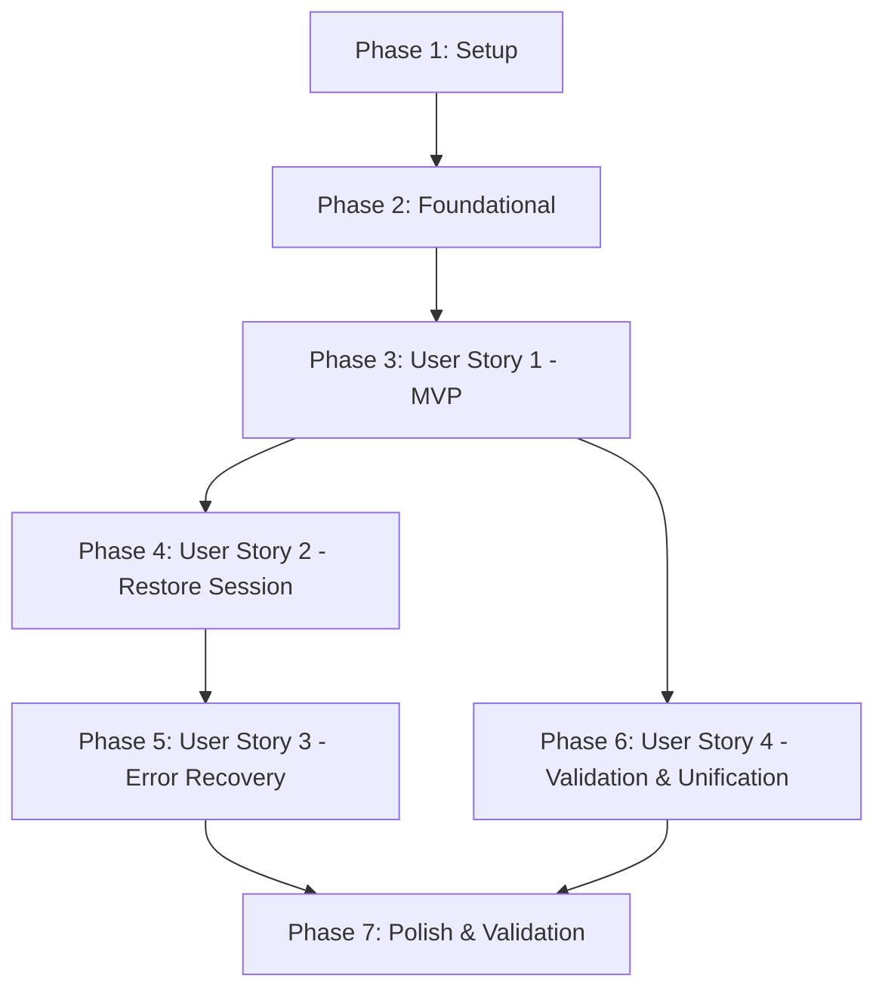

# Tasks: Onboarding Inicial do Compass

**Feature**: `001-initial-onboarding` | **Status**: Completed

## Phase 1: Setup (Shared Infrastructure & Projects)

**Purpose**: Inicialização da solution .NET, estrutura de projetos do backend e setup do frontend Vue 3.

- [X] T001 Criar a solution `Compass.sln` na raiz do repositório
- [X] T002 [P] Inicializar projetos backend do módulo Calendar em `src/Modules/Calendar/`: `Compass.Modules.Calendar.Contracts`, `Compass.Modules.Calendar.Domain`, `Compass.Modules.Calendar.Application`, `Compass.Modules.Calendar.Infrastructure` e `Compass.Modules.Calendar.Presentation`
- [X] T003 [P] Inicializar projeto composition root `src/Host/Compass.Host` com suporte a Minimal APIs e registrar referências para o módulo Calendar
- [X] T004 [P] Inicializar projetos de testes backend em `tests/`: `Compass.Modules.Calendar.Domain.UnitTests`, `Compass.Modules.Calendar.Application.UnitTests`, `Compass.Modules.Calendar.IntegrationTests` e `Compass.Host.IntegrationTests`
- [X] T005 [P] Inicializar projeto frontend em `frontend/` com Vite, Vue 3, TypeScript estrito, Vue Router, `@tanstack/vue-query` e Vitest

---

## Phase 2: Foundational (Blocking Prerequisites)

**Purpose**: Infraestrutura base de CQRS, persistência PostgreSQL com EF Core, fixture de testes e configuração base do frontend.

**⚠️ CRITICAL**: Nenhuma tarefa de user story pode ser iniciada antes da conclusão desta fase.

- [X] T006 [P] Definir abstrações base de CQRS (`ICommand`, `ICommandHandler`, `IQuery`, `IQueryHandler`) em `src/Modules/Calendar/Compass.Modules.Calendar.Application/Abstractions/`
- [X] T007 [P] Configurar `CalendarDbContext` com schema dedicado `calendar` em `src/Modules/Calendar/Compass.Modules.Calendar.Infrastructure/Persistence/CalendarDbContext.cs`
- [X] T008 [P] Configurar fixture de testes de integração com Testcontainers PostgreSQL em `tests/Compass.Modules.Calendar.IntegrationTests/TestDatabaseFixture.cs`
- [X] T009 [P] Configurar `CustomWebApplicationFactory` para testes E2E da API em `tests/Compass.Host.IntegrationTests/CustomWebApplicationFactory.cs`
- [X] T010 [P] Configurar tokens CSS neutros e estilos base em `frontend/src/app/styles/tokens.css`
- [X] T011 [P] Configurar cliente TanStack Query, rotas base do Vue Router e componente raiz em `frontend/src/app/`

**Checkpoint**: Fundação pronta - a implementação das User Stories pode iniciar.

---

## Phase 3: User Story 1 - Primeiro Acesso e Configuração de Perfil Inicial (Priority: P1) 🎯 MVP

**Goal**: Permitir que um novo usuário passe pelo fluxo de onboarding em 5 etapas no frontend, criando seu `ScheduleProfile` no backend com timezone IANA e disponibilidade semanal padrão, salvando o identificador retornado no `localStorage` e sendo redirecionado para a tela "Hoje".

**Independent Test**: Com `localStorage` limpo, acessar a aplicação, preencher as etapas de apresentação, timezone e disponibilidade semanal, confirmar e validar que o backend responde `201 Created` com o ID do perfil e o frontend redireciona para `/today`.

### Tests for User Story 1

- [X] T012 [P] [US1] Testes unitários do agregado `ScheduleProfile` e criação inicial em `tests/Compass.Modules.Calendar.Domain.UnitTests/ScheduleProfileTests.cs`
- [X] T013 [P] [US1] Testes unitários de `CreateScheduleProfileCommandHandler` em `tests/Compass.Modules.Calendar.Application.UnitTests/CreateScheduleProfileCommandHandlerTests.cs`
- [X] T014 [P] [US1] Testes de integração de persistência de `ScheduleProfile` no PostgreSQL em `tests/Compass.Modules.Calendar.IntegrationTests/ScheduleProfilePersistenceTests.cs`
- [X] T015 [P] [US1] Teste E2E de criação de perfil via `POST /api/calendar/schedule-profiles` em `tests/Compass.Host.IntegrationTests/CreateScheduleProfileApiTests.cs`
- [X] T016 [P] [US1] Testes Vitest dos componentes de etapas do onboarding em `frontend/src/features/onboarding/__tests__/OnboardingWizard.spec.ts`

### Implementation for User Story 1

- [X] T017 [P] [US1] Implementar agregado `ScheduleProfile`, entidade `DayAvailabilityRule` e Value Objects `TimeWindow` e `TimeZoneId` em `src/Modules/Calendar/Compass.Modules.Calendar.Domain/Model/`
- [X] T018 [P] [US1] Implementar DTOs de criação e comando `CreateScheduleProfileCommand` com `CreateScheduleProfileCommandHandler` em `src/Modules/Calendar/Compass.Modules.Calendar.Application/Commands/`
- [X] T019 [US1] Implementar mapeamento EF Core `ScheduleProfileConfiguration` e repositório `ScheduleProfileRepository` em `src/Modules/Calendar/Compass.Modules.Calendar.Infrastructure/Persistence/` (depende de T017, T007)
- [X] T020 [US1] Gerar migration inicial EF Core para schema `calendar` em `src/Modules/Calendar/Compass.Modules.Calendar.Infrastructure/Migrations/`
- [X] T021 [US1] Implementar endpoints Minimal API `POST /api/calendar/schedule-profiles` e `GET /api/calendar/timezones` em `src/Modules/Calendar/Compass.Modules.Calendar.Presentation/Endpoints/CalendarEndpoints.cs`
- [X] T022 [P] [US1] Implementar componentes de UI acessíveis (`AppButton.vue`, `AppInput.vue`, `AppSelect.vue`, `TimeRangePicker.vue`) em `frontend/src/shared/ui/`
- [X] T023 [P] [US1] Implementar cliente de API e composable `useCreateScheduleProfileMutation` em `frontend/src/entities/schedule-profile/`
- [X] T024 [US1] Implementar componentes de etapas do onboarding (`StepPresentation.vue`, `StepTimeZone.vue`, `StepAvailability.vue`, `StepConfirmation.vue`) e página `OnboardingPage.vue` em `frontend/src/features/onboarding/` e `frontend/src/pages/onboarding/`

**Checkpoint**: User Story 1 funcional e testável de ponta a ponta como MVP.

---

## Phase 4: User Story 2 - Restauração Automática de Sessão / F5 (Priority: P1)

**Goal**: Garantir que, ao recarregar a página (F5) ou em visitas subsequentes com identificador válido no `localStorage`, o frontend restaure o perfil buscando timezone e disponibilidade reais do backend e apresente a tela "Hoje".

**Independent Test**: Concluir o onboarding, recarregar a página no navegador (F5) e verificar que a tela `/today` carrega os dados reais de fuso e disponibilidade via consulta remota.

### Tests for User Story 2

- [X] T025 [P] [US2] Testes unitários do query handler `GetScheduleProfileByIdQueryHandler` em `tests/Compass.Modules.Calendar.Application.UnitTests/GetScheduleProfileByIdQueryHandlerTests.cs`
- [X] T026 [P] [US2] Teste E2E de consulta `GET /api/calendar/schedule-profiles/{id}` em `tests/Compass.Host.IntegrationTests/GetScheduleProfileApiTests.cs`
- [X] T027 [P] [US2] Testes Vitest de carregamento de perfil remoto na tela Hoje em `frontend/src/pages/today/__tests__/TodayPage.spec.ts`

### Implementation for User Story 2

- [X] T028 [P] [US2] Implementar `GetScheduleProfileByIdQuery` e `GetScheduleProfileByIdQueryHandler` em `src/Modules/Calendar/Compass.Modules.Calendar.Application/Queries/`
- [X] T029 [US2] Implementar endpoint Minimal API `GET /api/calendar/schedule-profiles/{id:guid}` em `src/Modules/Calendar/Compass.Modules.Calendar.Presentation/Endpoints/CalendarEndpoints.cs`
- [X] T030 [P] [US2] Implementar composable `useScheduleProfileQuery` e helper de storage `profileStorage.ts` em `frontend/src/entities/schedule-profile/`
- [X] T031 [US2] Implementar tela `TodayPage.vue` consumindo `useScheduleProfileQuery` e exibindo timezone e disponibilidade reais em `frontend/src/pages/today/TodayPage.vue`

**Checkpoint**: User Stories 1 e 2 funcionais; sessão persiste e restaura dados reais do backend após F5.

---

## Phase 5: User Story 3 - Recuperação de Identificador Inválido ou Ausente (Priority: P2)

**Goal**: Redirecionar com segurança o usuário de volta ao onboarding caso o identificador local não exista no backend (404) ou se nenhuma sessão prévia estiver configurada.

**Independent Test**: Gravar um GUID inexistente no `localStorage` e recarregar a página; verificar que o erro 404 limpa o identificador corrompido e redireciona imediatamente para `/onboarding`.

### Tests for User Story 3

- [X] T032 [P] [US3] Teste E2E de retorno 404 para ID inexistente em `tests/Compass.Host.IntegrationTests/GetScheduleProfileNotFoundTests.cs`
- [X] T033 [P] [US3] Testes Vitest do router guard e limpeza de ID inválido em `frontend/src/app/router/__tests__/authGuard.spec.ts`

### Implementation for User Story 3

- [X] T034 [US3] Configurar guard de navegação no Vue Router para checar identificador ativo antes de rotas protegidas em `frontend/src/app/router/index.ts`
- [X] T035 [US3] Tratar erro 404 no composable de consulta limpando o `localStorage` e disparando redirect para `/onboarding` em `frontend/src/entities/schedule-profile/model/useScheduleProfileQuery.ts`

**Checkpoint**: Recuperação de falha e proteção de navegação implementadas e validadas.

---

## Phase 6: User Story 4 - Validação e Normalização de Janelas e Timezone (Priority: P2)

**Goal**: Assegurar integridade estrita dos dados rejeitando timezones IANA desconhecidos, bloqueando janelas onde `StartTime >= EndTime`, e unificando deterministicamente intervalos sobrepostos ou contíguos no mesmo dia.

**Independent Test**: Submeter horários sobrepostos (ex.: 09:00-12:00 e 11:00-15:00) e verificar que o backend salva a janela unificada 09:00-15:00; submeter fuso inválido ou `StartTime >= EndTime` e verificar retorno 400 Bad Request com ProblemDetails.

### Tests for User Story 4

- [X] T036 [P] [US4] Testes unitários das invariantes de `TimeWindow` (`StartTime < EndTime`) e unificação de sobreposições em `tests/Compass.Modules.Calendar.Domain.UnitTests/TimeWindowTests.cs`
- [X] T037 [P] [US4] Testes unitários de validação de `TimeZoneId` IANA em `tests/Compass.Modules.Calendar.Domain.UnitTests/TimeZoneIdTests.cs`
- [X] T038 [P] [US4] Testes E2E de validação com retorno 400 Bad Request em `tests/Compass.Host.IntegrationTests/ScheduleProfileValidationApiTests.cs`
- [X] T039 [P] [US4] Testes Vitest de validação de horários na etapa de disponibilidade em `frontend/src/features/onboarding/__tests__/StepAvailabilityValidation.spec.ts`

### Implementation for User Story 4

- [X] T040 [P] [US4] Implementar validação e parsing estrito de IANA em `src/Modules/Calendar/Compass.Modules.Calendar.Domain/Model/TimeZoneId.cs`
- [X] T041 [P] [US4] Implementar método de unificação determinística de intervalos em `src/Modules/Calendar/Compass.Modules.Calendar.Domain/Model/TimeWindow.cs` e `DayAvailabilityRule.cs`
- [X] T042 [US4] Integrar validações com FluentValidation ou Domain Validation Handler na camada Application em `src/Modules/Calendar/Compass.Modules.Calendar.Application/Validation/`
- [X] T043 [US4] Adicionar mensagens e feedback visual de validação de horários no componente `StepAvailability.vue` em `frontend/src/features/onboarding/components/StepAvailability.vue`

**Checkpoint**: Todas as 4 User Stories implementadas com validação e normalização completas.

---

## Phase 7: Polish & Cross-Cutting Concerns

**Purpose**: Verificação de acessibilidade por teclado, responsividade móvel, conformidade com a Constituição e execução do quickstart.

- [X] T044 [P] Validar acessibilidade completa por teclado (Tab, Enter, Espaço, Escape) e contraste nos componentes do frontend
- [X] T045 [P] Validar responsividade e renderização do assistente de onboarding em tela móvel (largura 320px+)
- [X] T046 Executar o roteiro completo de validação ponta a ponta conforme descrito em `specs/001-initial-onboarding/quickstart.md`

---

## Dependencies & Execution Order

### Phase Dependencies

### Parallel Opportunities

- **Phase 1**: T002, T003, T004 e T005 podem ser executadas em paralelo após T001.
- **Phase 2**: T006, T007, T008, T009, T010 e T011 podem ser executadas em paralelo.
- **Phase 3 (US1)**: Testes T012, T013, T014, T015 e T016 podem ser escritos e executados em paralelo; T017, T018, T022 e T023 podem ser implementadas em paralelo.
- **Phase 4 (US2)**: Testes T025, T026 e T027 em paralelo; T028 e T030 em paralelo.
- **Phase 5 (US3)**: Testes T032 e T033 em paralelo.
- **Phase 6 (US4)**: Testes T036, T037, T038 e T039 em paralelo; T040 e T041 em paralelo.
- **Phase 7**: T044 e T045 em paralelo.

---

## Implementation Strategy

### MVP Scope (Phase 1 + Phase 2 + Phase 3)
1. Concluir Setup e Foundational.
2. Implementar e testar User Story 1 (Onboarding 5 passos + criação no backend com PostgreSQL).
3. **Validar MVP**: Executar testes e verificar criação de perfil funcional.

### Incremental Delivery
1. **Incremento 1**: MVP (Setup + Foundation + US1) -> Cadastro de perfil e redirecionamento inicial.
2. **Incremento 2**: US2 -> Restauração de sessão e dados reais após F5.
3. **Incremento 3**: US3 -> Tratamento de ID inválido e proteção de navegação.
4. **Incremento 4**: US4 -> Validação rigorosa e unificação de janelas sobrepostas.
5. **Incremento 5**: Polish -> Validação de acessibilidade por teclado, layout móvel e quickstart.
