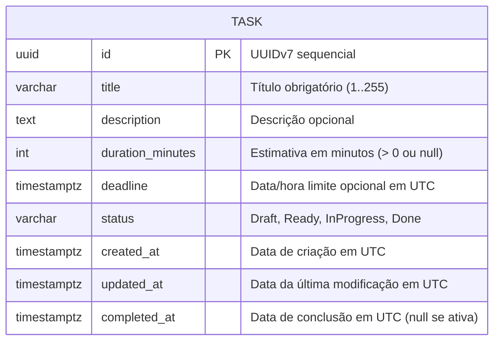
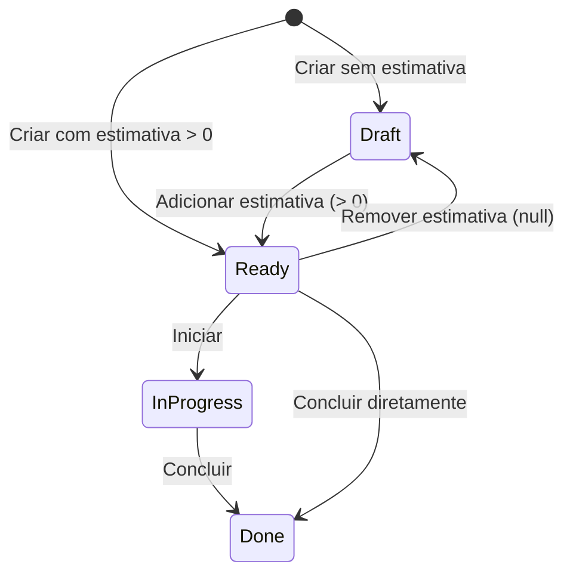

# Data Model: Planning Inbox (Tasks)

**Feature**: `002-planning-inbox` | **Status**: Approved

---

## 1. Diagrama de Entidades



---

## 2. Enum: `TaskStatus`

| Valor | Descrição | Candidato ao Planejamento Diário? |
|---|---|---|
| `Draft` | Tarefa recém-capturada sem estimativa de duração definida. | **NÃO** |
| `Ready` | Tarefa refinada com estimativa de duração positiva (`DurationMinutes > 0`). | **SIM** |
| `InProgress` | Tarefa em execução ativa. | **SIM** |
| `Done` | Tarefa concluída. | **NÃO** |

---

## 3. Máquina de Estados da Tarefa



---

## 4. Invariantes de Domínio do Agregado `Task`

1. **Título Obrigatório**: O título não pode ser nulo, vazio ou conter apenas espaços em branco. Tamanho máximo: 255 caracteres.
2. **Estimativa Estritamente Positiva**: Se informada, `DurationMinutes` deve ser maior que zero (`DurationMinutes > 0`). Valores `<= 0` lançam `PlanningDomainException`.
3. **Consistência de Status x Estimativa**:
   - Uma tarefa `Draft` nunca possui `DurationMinutes` válido (é sempre `null`).
   - Uma tarefa `Ready`, `InProgress` ou `Done` (quando criada/promovida com estimativa) possui `DurationMinutes > 0`.
4. **Restrição de Início (`Start`)**: Apenas tarefas com status `Ready` podem ser iniciadas (`InProgress`). Tarefas `Draft` ou `Done` são rejeitadas.
5. **Registro de Conclusão (`Complete`)**: Ao concluir, `Status` torna-se `Done` e `CompletedAt` recebe o timestamp UTC corrente.
6. **Imutabilidade Pós-Conclusão**: Tarefas `Done` não podem ter seu título, estimativa ou deadline alterados sem fluxo explícito de reabertura.

---

## 5. Mapeamento de Tabela no PostgreSQL (Schema `planning`)

```sql
CREATE SCHEMA IF NOT EXISTS planning;

CREATE TABLE planning.tasks (
    "Id" uuid NOT NULL,
    title varchar(255) NOT NULL,
    description text NULL,
    duration_minutes integer NULL,
    deadline timestamptz NULL,
    status varchar(50) NOT NULL,
    created_at timestamptz NOT NULL,
    updated_at timestamptz NOT NULL,
    completed_at timestamptz NULL,
    CONSTRAINT "PK_tasks" PRIMARY KEY ("Id")
);

CREATE INDEX "IX_tasks_status" ON planning.tasks (status);
CREATE INDEX "IX_tasks_created_at" ON planning.tasks (created_at);
```
