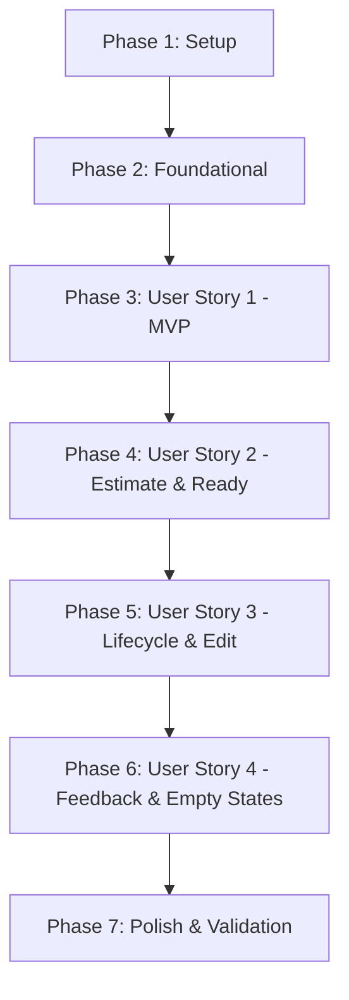

# Tasks: Planning Inbox Inicial

**Feature**: `002-planning-inbox` | **Status**: Completed

## Phase 1: Setup (Shared Infrastructure & Projects)

**Purpose**: Inicialização dos projetos .NET do módulo Planning e registro na solution.

- [X] T001 Inicializar projetos backend do módulo Planning em `src/Modules/Planning/`: `Compass.Modules.Planning.Contracts`, `Compass.Modules.Planning.Domain`, `Compass.Modules.Planning.Application`, `Compass.Modules.Planning.Infrastructure` e `Compass.Modules.Planning.Presentation`
- [X] T002 [P] Adicionar projetos do módulo Planning à solution `Compass.slnx`
- [X] T003 [P] Inicializar projetos de testes backend em `tests/`: `Compass.Modules.Planning.Domain.UnitTests`, `Compass.Modules.Planning.Application.UnitTests` e `Compass.Modules.Planning.IntegrationTests`
- [X] T004 [P] Configurar referências entre projetos e pacotes NuGet (`Npgsql.EntityFrameworkCore.PostgreSQL`, `FluentValidation`, `FluentAssertions`, `Testcontainers.PostgreSql`, `Microsoft.AspNetCore.Mvc.Testing`)

---

## Phase 2: Foundational (Blocking Prerequisites)

**Purpose**: Infraestrutura de persistência no schema PostgreSQL `planning`, repositório base, fixture de testes e rotas frontend.

**⚠️ CRITICAL**: Nenhuma tarefa de user story pode ser iniciada antes da conclusão desta fase.

- [X] T005 [P] Configurar `PlanningDbContext` com schema dedicado `planning` em `src/Modules/Planning/Compass.Modules.Planning.Infrastructure/Persistence/PlanningDbContext.cs`
- [X] T006 [P] Definir interface `ITaskRepository` em `src/Modules/Planning/Compass.Modules.Planning.Domain/Repositories/ITaskRepository.cs`
- [X] T007 [P] Configurar fixture de testes de integração com Testcontainers PostgreSQL em `tests/Compass.Modules.Planning.IntegrationTests/PlanningTestDatabaseFixture.cs`
- [X] T008 [P] Configurar extensões de DI `PlanningApplicationExtensions`, `PlanningInfrastructureExtensions` e `PlanningModuleExtensions` em `src/Modules/Planning/`
- [X] T009 Registrar o módulo Planning na composition root `src/Host/Compass.Host/Program.cs`
- [X] T010 [P] Configurar rota `/planning` e navegação no frontend em `frontend/src/app/router/index.ts` e `frontend/src/app/App.vue`

**Checkpoint**: Fundação pronta - a implementação das User Stories pode iniciar.

---

## Phase 3: User Story 1 - Captura Rápida e Visualização na Inbox (Priority: P1) 🎯 MVP

**Goal**: Permitir que o usuário capture rapidamente uma tarefa informando apenas o título (iniciando como `Draft`), visualize a lista de tarefas organizadas por status na Inbox e tenha persistência garantida após recarregar a página (F5).

**Independent Test**: Acessar `/planning`, cadastrar uma tarefa pelo formulário de captura rápida, validar que ela surge imediatamente na coluna/aba `Draft` e persiste após F5 com dados recuperados do PostgreSQL.

### Tests for User Story 1

- [X] T011 [P] [US1] Testes unitários do agregado `Task` (criação rápida, status inicial `Draft`, validação de título) em `tests/Compass.Modules.Planning.Domain.UnitTests/TaskTests.cs`
- [X] T012 [P] [US1] Testes unitários de `CreateTaskCommandHandler` e `GetTasksQueryHandler` em `tests/Compass.Modules.Planning.Application.UnitTests/TaskHandlerTests.cs`
- [X] T013 [P] [US1] Testes de integração de persistência de `Task` no schema `planning` do PostgreSQL em `tests/Compass.Modules.Planning.IntegrationTests/TaskPersistenceTests.cs`
- [X] T014 [P] [US1] Testes E2E de criação e listagem via `POST /api/planning/tasks` e `GET /api/planning/tasks` em `tests/Compass.Host.IntegrationTests/TaskApiTests.cs`
- [X] T015 [P] [US1] Testes Vitest de captura rápida e listagem na Inbox em `frontend/src/features/planning-inbox/__tests__/PlanningInbox.spec.ts`

### Implementation for User Story 1

- [X] T016 [P] [US1] Implementar agregado raiz `Task` e enum `TaskStatus` (`Draft`, `Ready`, `InProgress`, `Done`) em `src/Modules/Planning/Compass.Modules.Planning.Domain/Model/`
- [X] T017 [P] [US1] Implementar DTOs públicos `TaskDto`, `CreateTaskDto` e interface `IPlanningModule` em `src/Modules/Planning/Compass.Modules.Planning.Contracts/`
- [X] T018 [P] [US1] Implementar comandos e queries CQRS `CreateTaskCommand`, `CreateTaskCommandHandler`, `GetTasksQuery` e `GetTasksQueryHandler` em `src/Modules/Planning/Compass.Modules.Planning.Application/`
- [X] T019 [US1] Implementar mapeamento EF Core `TaskConfiguration` e repositório `TaskRepository` em `src/Modules/Planning/Compass.Modules.Planning.Infrastructure/Persistence/` (depende de T016, T005)
- [X] T020 [US1] Implementar endpoints Minimal API `POST /api/planning/tasks` e `GET /api/planning/tasks` em `src/Modules/Planning/Compass.Modules.Planning.Presentation/Endpoints/PlanningEndpoints.cs`
- [X] T021 [P] [US1] Implementar cliente de API e composables TanStack Vue Query (`useTasksQuery.ts`, `useCreateTaskMutation.ts`) em `frontend/src/entities/task/`
- [X] T022 [P] [US1] Implementar componentes de UI da Inbox (`QuickTaskCapture.vue`, `TaskCard.vue`, `TaskFilterTabs.vue`) em `frontend/src/features/planning-inbox/components/`
- [X] T023 [US1] Implementar página principal `PlanningPage.vue` orquestrando a Inbox em `frontend/src/pages/planning/PlanningPage.vue`

**Checkpoint**: User Story 1 funcional e testável de ponta a ponta como MVP.

---

## Phase 4: User Story 2 - Estimativa de Duração e Promoção para Ready (Priority: P1)

**Goal**: Permitir que o usuário defina uma estimativa em minutos positiva (`DurationMinutes > 0`) em uma tarefa `Draft`, fazendo com que o backend a promova automaticamente para o status `Ready`, tornando-a elegível para futuros planejamentos diários.

**Independent Test**: Selecionar uma tarefa `Draft`, informar uma estimativa válida (ex.: `45` min), salvar e constatar que a tarefa passa para o status `Ready` e move-se para a aba de tarefas prontas.

### Tests for User Story 2

- [X] T024 [P] [US2] Testes unitários do método `SetEstimate` do agregado `Task` (promoção para `Ready`, rebaixamento para `Draft`, rejeição de estimativa `<= 0`) em `tests/Compass.Modules.Planning.Domain.UnitTests/TaskEstimateTests.cs`
- [X] T025 [P] [US2] Testes unitários de `SetTaskEstimateCommandHandler` em `tests/Compass.Modules.Planning.Application.UnitTests/SetTaskEstimateCommandHandlerTests.cs`
- [X] T026 [P] [US2] Testes E2E de API para atualização de estimativa e transição `Ready` via `PATCH /api/planning/tasks/{id}` em `tests/Compass.Host.IntegrationTests/TaskEstimateApiTests.cs`
- [X] T027 [P] [US2] Testes Vitest de definição de estimativa e atualização de badge no card em `frontend/src/features/planning-inbox/__tests__/TaskEstimate.spec.ts`

### Implementation for User Story 2

- [X] T028 [P] [US2] Implementar método de domínio `SetEstimate(int? durationMinutes)` no agregado `Task` com validação de estimativa positiva em `src/Modules/Planning/Compass.Modules.Planning.Domain/Model/Task.cs`
- [X] T029 [P] [US2] Implementar comando `SetTaskEstimateCommand` e handler `SetTaskEstimateCommandHandler` em `src/Modules/Planning/Compass.Modules.Planning.Application/Commands/`
- [X] T030 [US2] Implementar endpoint `PATCH /api/planning/tasks/{id:guid}` em `src/Modules/Planning/Compass.Modules.Planning.Presentation/Endpoints/PlanningEndpoints.cs`
- [X] T031 [P] [US2] Implementar composable `useUpdateTaskEstimateMutation.ts` em `frontend/src/entities/task/model/`
- [X] T032 [US2] Integrar controle inline de estimativa e exibição de badge de status no componente `TaskCard.vue` em `frontend/src/features/planning-inbox/components/TaskCard.vue`

**Checkpoint**: User Stories 1 e 2 funcionais; tarefas `Draft` podem ser estimadas e promovidas para `Ready`.

---

## Phase 5: User Story 3 - Edição e Ciclo de Vida da Tarefa (InProgress e Done) (Priority: P2)

**Goal**: Permitir a edição completa da tarefa (título, descrição, estimativa, deadline) e permitir o avanço do seu ciclo de vida iniciando (`InProgress`) ou concluindo (`Done`) a tarefa com validações estritas pelo backend.

**Independent Test**: Pegar uma tarefa `Ready`, clicar em "Iniciar" (status passa para `InProgress`), em seguida clicar em "Concluir" (status passa para `Done` com `completedAt` preenchido); testar rejeição de início em tarefas `Draft`.

### Tests for User Story 3

- [X] T033 [P] [US3] Testes unitários das transições `Start()`, `Complete()` e edição de detalhes no agregado `Task` em `tests/Compass.Modules.Planning.Domain.UnitTests/TaskLifecycleTests.cs`
- [X] T034 [P] [US3] Testes unitários de `StartTaskCommandHandler` e `CompleteTaskCommandHandler` em `tests/Compass.Modules.Planning.Application.UnitTests/TaskLifecycleHandlerTests.cs`
- [X] T035 [P] [US3] Testes E2E de API `POST /api/planning/tasks/{id}/start` e `POST /api/planning/tasks/{id}/complete` em `tests/Compass.Host.IntegrationTests/TaskLifecycleApiTests.cs`
- [X] T036 [P] [US3] Testes Vitest do modal de edição e botões de ação de ciclo de vida em `frontend/src/features/planning-inbox/__tests__/TaskLifecycle.spec.ts`

### Implementation for User Story 3

- [X] T037 [P] [US3] Implementar métodos `Start()`, `Complete()` e `UpdateDetails()` no agregado `Task` em `src/Modules/Planning/Compass.Modules.Planning.Domain/Model/Task.cs`
- [X] T038 [P] [US3] Implementar comandos `StartTaskCommand`, `CompleteTaskCommand`, `UpdateTaskDetailsCommand` e seus handlers em `src/Modules/Planning/Compass.Modules.Planning.Application/Commands/`
- [X] T039 [US3] Implementar endpoints `POST /api/planning/tasks/{id:guid}/start`, `POST /api/planning/tasks/{id:guid}/complete` e `GET /api/planning/tasks/{id:guid}` em `src/Modules/Planning/Compass.Modules.Planning.Presentation/Endpoints/PlanningEndpoints.cs`
- [X] T040 [P] [US3] Implementar composables `useStartTaskMutation.ts` e `useCompleteTaskMutation.ts` em `frontend/src/entities/task/model/`
- [X] T041 [US3] Implementar modal de edição `TaskEditModal.vue` com campos de título, estimativa e deadline em `frontend/src/features/planning-inbox/components/TaskEditModal.vue`
- [X] T042 [US3] Integrar botões de ação ("Iniciar", "Concluir", "Editar") no card `TaskCard.vue`

**Checkpoint**: User Stories 1, 2 e 3 funcionais; ciclo de vida completo de tarefas operante.

---

## Phase 6: User Story 4 - Resiliência, Feedback Visual e Estados Vazios (Priority: P2)

**Goal**: Garantir estados visuais informativos e acolhedores para seções vazias, feedback de carregamento não-bloqueante e exibição clara de erros de validação da API.

**Independent Test**: Acessar abas da Inbox sem tarefas cadastradas e verificar as mensagens amigáveis de estado vazio; simular falhas de validação/rede e constatar alertas descritivos.

### Tests for User Story 4

- [X] T043 [P] [US4] Testes Vitest de renderização de estados vazios (Empty States), loading skeletons e tratamento de erro de rede em `frontend/src/features/planning-inbox/__tests__/PlanningFeedback.spec.ts`

### Implementation for User Story 4

- [X] T044 [P] [US4] Implementar componente de estado vazio `EmptyState.vue` em `frontend/src/shared/ui/EmptyState.vue`
- [X] T045 [US4] Integrar feedback de erro e estado vazio nas abas da Inbox em `frontend/src/pages/planning/PlanningPage.vue`

---

## Phase 7: Polish & Cross-Cutting Concerns

**Purpose**: Verificação de acessibilidade por teclado, responsividade móvel, conformidade com a Constituição e execução do quickstart.

- [X] T046 [P] Validar acessibilidade completa por teclado (Tab, Enter, Espaço, Escape) e contraste nos componentes da Inbox
- [X] T047 [P] Validar responsividade e renderização da Inbox em tela móvel (largura 320px+)
- [X] T048 Executar o roteiro completo de validação ponta a ponta conforme descrito em `specs/002-planning-inbox/quickstart.md`

---

## Dependencies & Execution Order

### Phase Dependencies

### Parallel Opportunities

- **Phase 1**: T002, T003 e T004 podem ser executadas em paralelo após T001.
- **Phase 2**: T005, T006, T007, T008 e T010 podem ser executadas em paralelo.
- **Phase 3 (US1)**: Testes T011, T012, T013, T014 e T015 em paralelo; T016, T017, T018, T021 e T022 em paralelo.
- **Phase 4 (US2)**: Testes T024, T025, T026 e T027 em paralelo; T028, T029 e T031 em paralelo.
- **Phase 5 (US3)**: Testes T033, T034, T035 e T036 em paralelo; T037, T038 e T040 em paralelo.
- **Phase 6 (US4)**: Testes T043 e componente T044 em paralelo.
- **Phase 7**: T046 e T047 em paralelo.

---

## Implementation Strategy

### MVP Scope (Phase 1 + Phase 2 + Phase 3)
1. Concluir Setup e Foundational do módulo `Planning`.
2. Implementar e testar User Story 1 (Captura rápida de tarefas `Draft`, listagem por status na Inbox e persistência no PostgreSQL).
3. **Validar MVP**: Executar testes e verificar a Inbox funcional.

### Incremental Delivery
1. **Incremento 1**: MVP (Setup + Foundation + US1) -> Captura rápida e persistência de tarefas.
2. **Incremento 2**: US2 -> Estimativa de duração e promoção para `Ready`.
3. **Incremento 3**: US3 -> Edição completa e avanço do ciclo de vida (`InProgress`, `Done`).
4. **Incremento 4**: US4 -> Estados vazios informativos e feedback visual de resiliência.
5. **Incremento 5**: Polish -> Validação de acessibilidade por teclado, layout móvel e quickstart.
