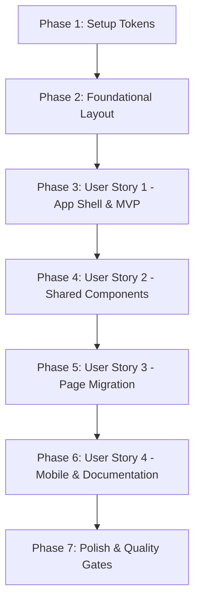

# Tasks: Fundação Visual Consistente e Migração de Interface

**Feature**: `003-frontend-visual-foundation` | **Status**: Completed

## Phase 1: Setup (Shared Tokens & Baseline Configuration)

**Purpose**: Definição da folha de estilos central, tokens semânticos neutros e configuração estrutural para temas Claro e Escuro.

- [x] T001 Atualizar `frontend/src/app/styles/tokens.css` com a nova escala de neutros controlada, tokens semânticos funcionais, tipografia de sistema, espaçamento e radius
- [x] T002 [P] Configurar variáveis CSS estruturadas para suporte a Light (padrão), Dark (`[data-theme="dark"]`) e `@media (prefers-color-scheme: dark)` em `frontend/src/app/styles/tokens.css`
- [x] T003 [P] Atualizar `frontend/src/app/App.vue` com estilo global do body, reset de layout e container principal

---

## Phase 2: Foundational (Layout & Shared App Shell)

**Purpose**: Criação dos componentes base de casca da aplicação (App Shell) e componentes estruturais compartilhados.

**⚠️ CRITICAL**: Nenhuma tarefa de user story pode ser concluída antes da disponibilidade dos componentes de layout e tokens centrais.

- [x] T004 [P] Implementar o componente `AppHeader.vue` com logotipo tipográfico do Compass, links de navegação (`Hoje`, `Planning`), divisores finos e sem emojis em `frontend/src/shared/ui/AppHeader.vue`
- [x] T005 [P] Implementar o componente de layout raiz `AppShell.vue` em `frontend/src/shared/ui/AppShell.vue`
- [x] T006 [P] Implementar componente de badge semântico `AppBadge.vue` em `frontend/src/shared/ui/AppBadge.vue`
- [x] T007 [P] Implementar container acessível de modal `AppModal.vue` com focus-trap e suporte a Escape em `frontend/src/shared/ui/AppModal.vue`

**Checkpoint**: Fundação pronta - componentes de layout e tokens disponíveis.

---

## Phase 3: User Story 1 - Tokens Semânticos Centrais e App Shell Unificado (Priority: P1) 🎯 MVP

**Goal**: Garantir que as páginas autenticadas compartilhem o mesmo cabeçalho, navegação, tipografia e tokens semânticos, permitindo transições fluidas e estáveis entre Hoje e Planning.

**Independent Test**: Navegar entre `/today` e `/planning` e constatar que o cabeçalho, tipografia, divisores e alinhamentos compartilham exatamente o mesmo App Shell sem choques visuais ou oscilações.

### Tests for User Story 1

- [x] T008 [P] [US1] Testes unitários do `AppShell.vue` e `AppHeader.vue` (renderização de navegação, rotas ativas, ausência de emojis) em `frontend/src/shared/ui/__tests__/AppShell.spec.ts`

### Implementation for User Story 1

- [x] T009 [P] [US1] Integrar o `AppShell.vue` em `frontend/src/pages/today/TodayPage.vue`
- [x] T010 [P] [US1] Integrar o `AppShell.vue` em `frontend/src/pages/planning/PlanningPage.vue`
- [x] T011 [US1] Validar transição visual fluida e estável entre as rotas `/today` e `/planning`

**Checkpoint**: User Story 1 funcional; App Shell compartilhado operante entre Hoje e Planning.

---

## Phase 4: User Story 2 - Padronização dos Componentes Base e Eliminação Total de Emojis (Priority: P1)

**Goal**: Padronizar todos os componentes atômicos de `shared/ui`, eliminando 100% dos emojis, aplicando foco visível (`focus-visible`), feedback consistente de estados (`hover`, `active`, `disabled`, `loading`) e conformidade com tokens semânticos.

**Independent Test**: Renderizar os componentes `AppButton`, `AppInput`, `AppSelect`, `TimeRangePicker`, `EmptyState` e `AppBadge` em testes e na interface, confirmando zero emojis, foco visível por teclado e ausência de cores hardcoded.

### Tests for User Story 2

- [x] T012 [P] [US2] Testes Vitest dos componentes base `AppButton.vue`, `AppInput.vue`, `AppSelect.vue`, `EmptyState.vue` e `AppBadge.vue` em `frontend/src/shared/ui/__tests__/SharedComponents.spec.ts`

### Implementation for User Story 2

- [x] T013 [P] [US2] Refatorar `AppButton.vue` eliminando cores hardcoded, adicionando variantes sóbrias (`primary`, `secondary`, `danger`, `ghost`), spinner SVG de loading e foco visível em `frontend/src/shared/ui/AppButton.vue`
- [x] T014 [P] [US2] Refatorar `AppInput.vue` consumindo tokens semânticos, anel de foco `focus-visible` e estados de erro em `frontend/src/shared/ui/AppInput.vue`
- [x] T015 [P] [US2] Refatorar `AppSelect.vue` com dropdown sóbrio, ícone SVG de seta com `currentColor` e foco de alto contraste em `frontend/src/shared/ui/AppSelect.vue`
- [x] T016 [P] [US2] Refatorar `TimeRangePicker.vue` removendo emojis, aplicando tokens semânticos e ícone SVG utilitário de remoção em `frontend/src/shared/ui/TimeRangePicker.vue`
- [x] T017 [P] [US2] Refatorar `EmptyState.vue` removendo emojis e substituindo por ícone utilitário SVG discreto e tokens neutros em `frontend/src/shared/ui/EmptyState.vue`

**Checkpoint**: User Stories 1 e 2 concluídas; componentes base 100% aderentes à Constituição de Design.

---

## Phase 5: User Story 3 - Migração Completa das Telas Existentes e Página 404 (Priority: P2)

**Goal**: Migrar visualmente as telas de Onboarding (`/onboarding`), Hoje (`/today`), Planning (`/planning`) e criar a página de rota não encontrada (`NotFoundPage.vue`), eliminando emojis, simplificando cards e aplicando divisores sutis.

**Independent Test**: Navegar por `/onboarding`, `/today`, `/planning` e `/rota-invalida`, confirmando que 100% das telas compartilham a mesma identidade visual sóbria e refinada.

### Tests for User Story 3

- [x] T018 [P] [US3] Atualizar testes de componentes de Onboarding para a nova semântica visual sem emojis em `frontend/src/features/onboarding/__tests__/OnboardingWizard.spec.ts`
- [x] T019 [P] [US3] Atualizar testes de Planning Inbox para a nova semântica visual sem emojis em `frontend/src/features/planning-inbox/__tests__/PlanningInbox.spec.ts`, `TaskEstimate.spec.ts`, `TaskLifecycle.spec.ts`
- [x] T020 [P] [US3] Atualizar testes da página Hoje em `frontend/src/pages/today/__tests__/TodayPage.spec.ts`

### Implementation for User Story 3

- [x] T021 [P] [US3] Refatorar componentes de etapas do Onboarding (`StepPresentation.vue`, `StepTimeZone.vue`, `StepAvailability.vue`, `StepConfirmation.vue`) removendo emojis e aplicando layout limpo em `frontend/src/features/onboarding/components/`
- [x] T022 [US3] Refatorar página de Onboarding `OnboardingPage.vue` com superfícies neutras limpas e layout refinado em `frontend/src/pages/onboarding/OnboardingPage.vue`
- [x] T023 [US3] Refatorar página Hoje `TodayPage.vue` adotando hierarquia tipográfica estilo Notion e divisores sutis em `frontend/src/pages/today/TodayPage.vue`
- [x] T024 [P] [US3] Refatorar componentes da Planning Inbox (`QuickTaskCapture.vue`, `TaskFilterTabs.vue`, `TaskCard.vue`, `TaskEditModal.vue`) removendo emojis, usando `AppModal`, `AppBadge` e bordas finas em `frontend/src/features/planning-inbox/components/`
- [x] T025 [US3] Refatorar página da Planning Inbox `PlanningPage.vue` integrando novos componentes e banners de erro sóbrios em `frontend/src/pages/planning/PlanningPage.vue`
- [x] T026 [P] [US3] Implementar página `NotFoundPage.vue` em `frontend/src/pages/not-found/NotFoundPage.vue` e registrar rota `/:pathMatch(.*)*` em `frontend/src/app/router/index.ts`

**Checkpoint**: User Stories 1, 2 e 3 concluídas; todas as telas migradas com sucesso.

---

## Phase 6: User Story 4 - Responsividade Mobile e Documentação do Design System (Priority: P2)

**Goal**: Garantir perfeita adaptabilidade em viewports móveis estreitos (320px+) e consolidar as diretrizes oficiais de design em `docs/design/FRONTEND_DESIGN_SYSTEM.md`.

**Independent Test**: Testar todas as telas em viewports de 320px e 375px confirmando zero overflow horizontal; revisar o guia `docs/design/FRONTEND_DESIGN_SYSTEM.md`.

### Implementation for User Story 4

- [x] T027 [P] [US4] Criar a documentação canônica do Design System em `docs/design/FRONTEND_DESIGN_SYSTEM.md` com princípios, tokens, catálogo de componentes, estados e anti-patterns
- [x] T028 [P] [US4] Validar e ajustar responsividade das telas `/onboarding`, `/today`, `/planning` e `NotFoundPage` para viewports estreitos (320px a 480px) em `frontend/src/`
- [x] T029 [US4] Validar conformidade de contraste WCAG AA e navegação completa por teclado em todas as telas

---

## Phase 7: Polish & Cross-Cutting Concerns

**Purpose**: Verificação rigorosa de ausência de emojis, ausência de cores hardcoded e execução de todos os quality gates.

- [x] T030 [P] Executar auditoria de código frontend garantindo 0 ocorrências de cores hex hardcoded fora de `tokens.css`
- [x] T031 [P] Executar auditoria de texto garantindo 0 emojis em todo o código e templates de `frontend/src/`
- [x] T032 Executar a suíte completa de testes do frontend (`npm test -- --run`) e verificação de tipos e build (`npm run build`)
- [x] T033 Executar a suíte de testes de regressão do backend (`dotnet test Compass.slnx`)
- [x] T034 Executar o roteiro de validação ponta a ponta descrito em `specs/003-frontend-visual-foundation/quickstart.md`

---

## Dependencies & Execution Order

### Phase Dependencies

### Parallel Opportunities

- **Phase 1**: T002 e T003 em paralelo após T001.
- **Phase 2**: T004, T005, T006 e T007 em paralelo.
- **Phase 3 (US1)**: Testes T008 em paralelo com integração T009 e T010.
- **Phase 4 (US2)**: Testes T012 em paralelo com T013, T014, T015, T016 e T017.
- **Phase 5 (US3)**: Testes T018, T019 e T020 em paralelo; T021, T024 e T026 em paralelo.
- **Phase 6 (US4)**: T027 e T028 em paralelo.
- **Phase 7**: T030 e T031 em paralelo.

---

## Implementation Strategy

### MVP Scope (Phase 1 + Phase 2 + Phase 3)
1. Estabelecer a folha de estilos `tokens.css` com a paleta neutra sóbria.
2. Construir o `AppShell.vue` e `AppHeader.vue`.
3. Integrar o App Shell nas telas Hoje e Planning, garantindo estabilidade e navegação fluida.
4. **Validar MVP**: Testar o layout compartilhado entre `/today` e `/planning`.

### Incremental Delivery
1. **Incremento 1**: MVP (Setup + Foundation + US1) -> Tokens semânticos centrais e App Shell compartilhado.
2. **Incremento 2**: US2 -> Padronização dos componentes atômicos de `shared/ui` e eliminação total de emojis.
3. **Incremento 3**: US3 -> Migração completa de Onboarding, Hoje, Planning e criação de `NotFoundPage.vue`.
4. **Incremento 4**: US4 -> Ajustes finos de responsividade mobile (320px+) e documentação canônica em `FRONTEND_DESIGN_SYSTEM.md`.
5. **Incremento 5**: Polish -> Auditoria de zero emojis, zero cores hardcoded e quality gates 100% verdes.
